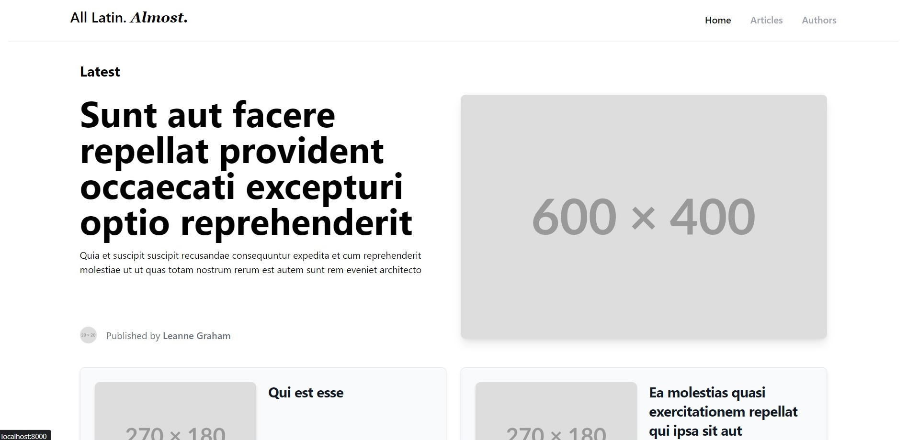
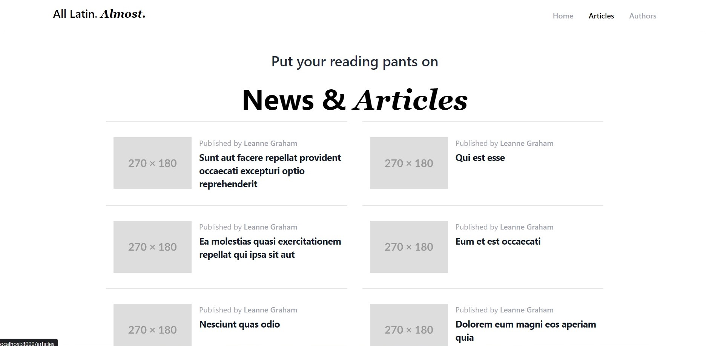

Simple template blog/news page

## Getting started

- run `composer install` to get necessary dependencies
- run `php -S localhost:8000` from `public` directory
- click on site that appears in terminal to open it in browser